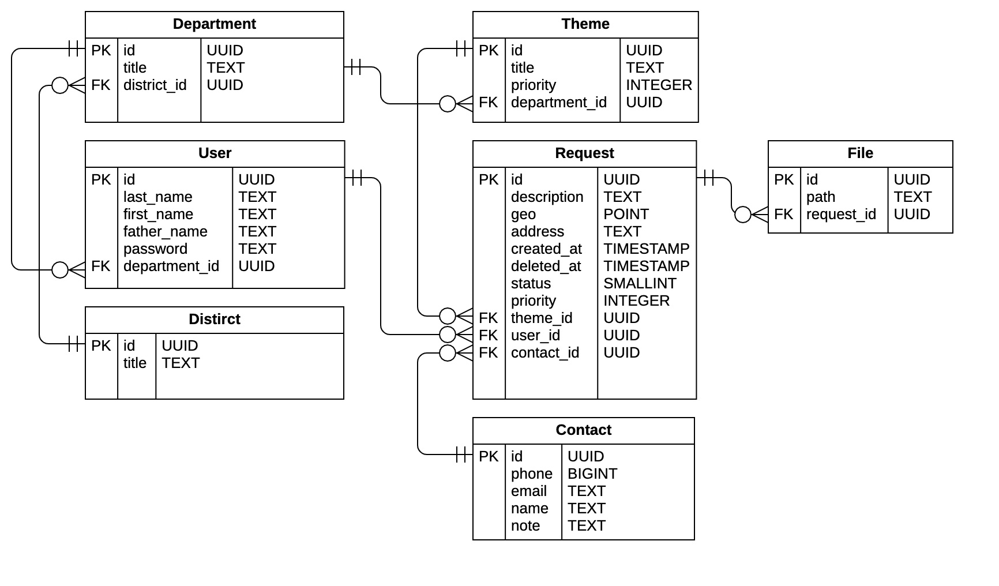

## Backend application of the residents-tracking-platform system

## Setup
`cp .env.example .env`

## Build
`docker compose build`

## Run
`docker compose up -d`

### Structure
```
.
├── .github/ –> CI/CD configuration
├── api/ -> .proto files
├── cmd/api/main.go -> entrypoint
├── docker/postgres/ -> pgsql extensions 
├── gen/ –> generated files
├── internal/
│   ├── api –> proto services implementations
│   ├── app -> app launch, service provider
│   ├── config
│   ├── model –> domain layer
│   ├── repository
│   ├── service -> buisness logic
│   └── storage -> file storage implementation
├── migrations/
├── mocks/ –> generated mocks
├── tools/
├── .env.example
├── .gitignore
├── docker-compose.yml
├── Dockerfile –> production dockerfile
├── Dockerfile.dev –> development dockerfile
├── Makefile
└── README.md
```

### Database architecture


#### Sources
[Golang Clean Architecture](https://github.com/bxcodec/go-clean-arch)